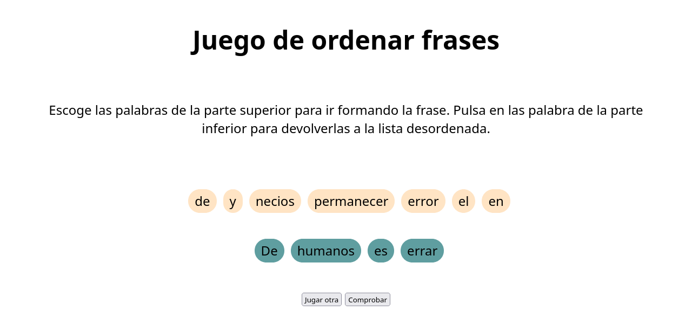
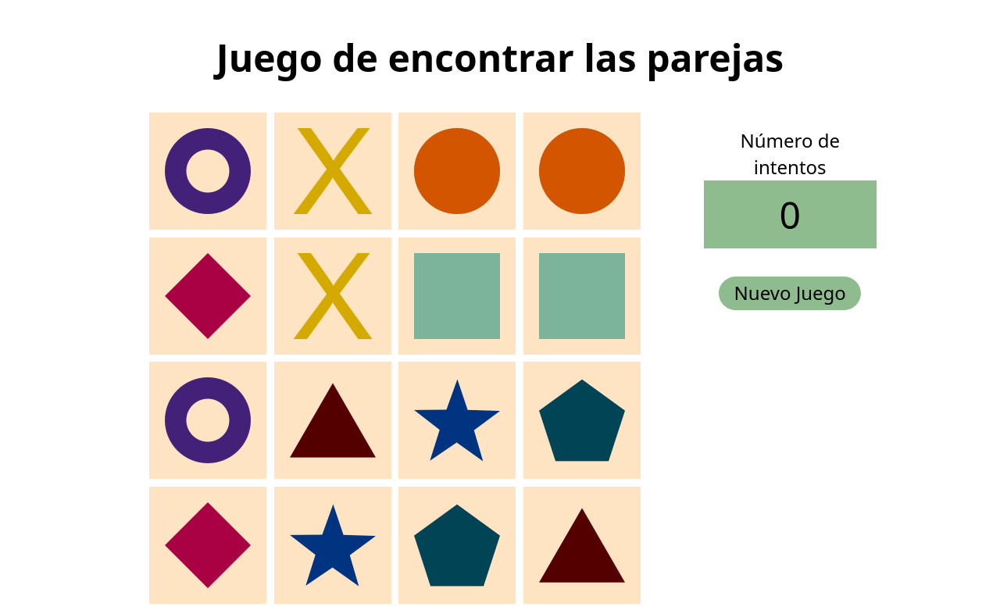

# JavaScript

## Ejercicios JavaScript durante IFCD0210

Contiene algunos de los ejercicios realizados durante el curso **IFCD0210 - Desarrollo de Aplicaciones Con Tecnologías WEB** (2023-2024).

Se muestran mis soluciones a los problemas planteados. Se puede abrir el fichero `html` en cualquier navegador siempre que se tengan los archivos `.html`, `.js` y `.css` en el mismo directorio.

Se han realizado utilizando:
- Servidor apache
- JavaScript
- HTML5
- CSS3

### Lista de ejercicios

- **Ej09**: Haz un pequeño juego de palabras que siga estas reglas:
    - Crea un array con 20 frases.
    - Selecciona de forma aleatoria una de las 20 frases y desordena las palabras que la componen.
    - Muestra al usuario las palabras desordenadas, para que luego, cuando pinche en una palabra se muestre debajo, de forma que podría ir montando la frase que cree que es la correcta.
    - Una vez la frase del usuario esté montada, debe pulsar un botón de validación para que compruebe si ha acertado o no.
- *Captura de mi resultado*:
    
- **Ej10**: Trata de hacer el juego de piedra, papel o tijera con una interfaz de usuario en la que pueda interaccionar de forma cómoda y amigable.
- **Ej11**: Crea el juego de las parejas. Debes buscar una serie de imágenes para realizarlo y luego:
    -  Muestra una cuadrícula donde se muestren aleatoriamente las imágenes con su imagen repetida durante un tiempo.
- *Captura de mi resultado*:
    
