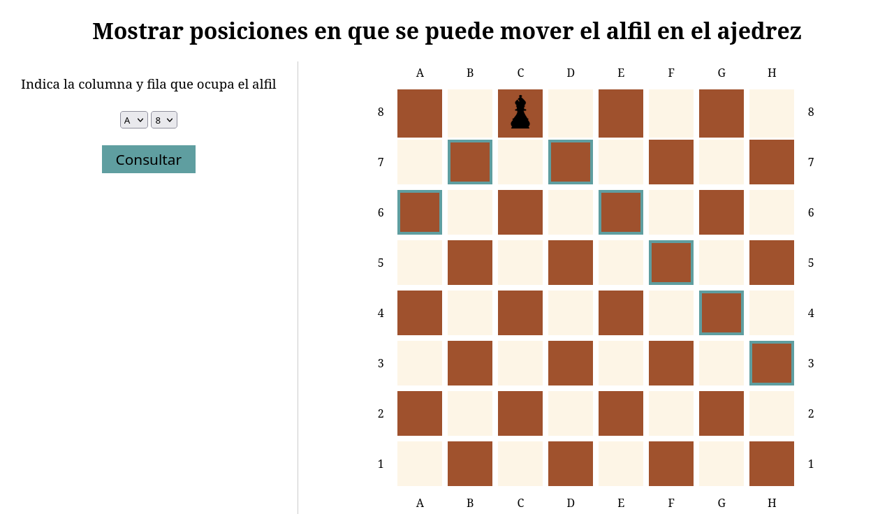
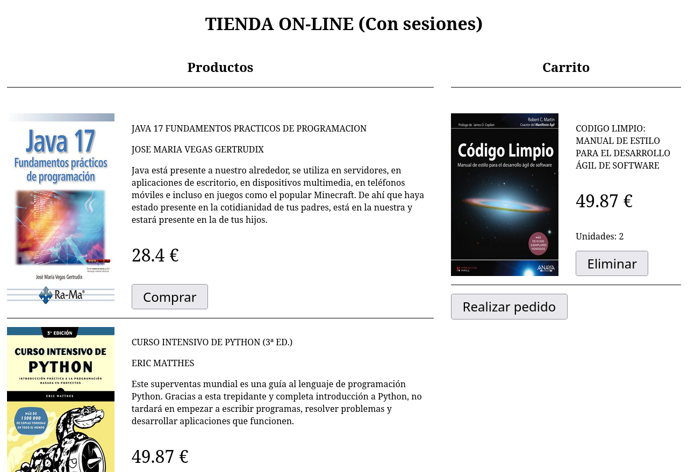

# PHP

## Retos PHP durante IFCD0210

Contiene algunos de los retos realizados durante el curso **IFCD0210 - Desarrollo de Aplicaciones Con Tecnologías WEB** (2023-2024).

Se muestran mis soluciones a los problemas planteados. Se puede abrir desde un servidor Apache.

Se han realizado utilizando:
- Servidor apache
- PHP 8
- HTML5
- CSS3

### Lista de retos

**Arrays**:

- **Ej10**: Realiza un programa que escoja al azar 10 cartas de la baraja española y que diga cuántos puntos suman según el juego de la brisca. Emplea un array asociativo para obtener los puntos a partir del nombre de la figura de la carta. Asegúrate de que no se repite ninguna carta, igual que si las hubieras cogido de una baraja de verdad.
    >NP: He creado la solución partiendo de los números o figuras de la baraja en un array y los palos en otro. De esta manera se pueden cambiar facilitando la creación una baraja de otro tipo.
- **Ej14**: Escribe un programa que, dada una posición en un tablero de ajedrez, nos diga a qué casillas podría saltar un alfil que se encuentra en esa posición. Indícalo de forma gráfica sobre el tablero con un color diferente para estas casillas donde puede saltar la figura. El alfil se mueve siempre en diagonal. El tablero cuenta con 64 casillas. Las columnas se indican con las letras de la “a” a la “h” y las filas se indican del 1 al 8.
- *Captura de mi resultado*:

**Sesiones y Cookies**:

- **Ej05**: Crea una tienda on-line sencilla con un catálogo de productos y un carrito de la compra. Un catálogo de cuatro o cinco productos será suficiente. De cada producto se debe conocer al menos la descripción y el precio. Todos los productos deben tener una imagen que los identifique. Al lado de cada producto del catálogo deberá aparecer un botón **Comprar** que permita añadirlo al carrito.
Si el usuario hace clic en el botón **Comprar** de un producto que ya estaba en el carrito, se deberá incrementar el número de unidades de dicho producto. Para cada producto que aparece en el carrito, habrá un botón **Eliminar** por si el usuario se arrepiente y quiere quitar un producto concreto del carrito de la compra. A continuación se muestra una captura de pantalla de una posible solución.
- *Captura de mi resultado*:
