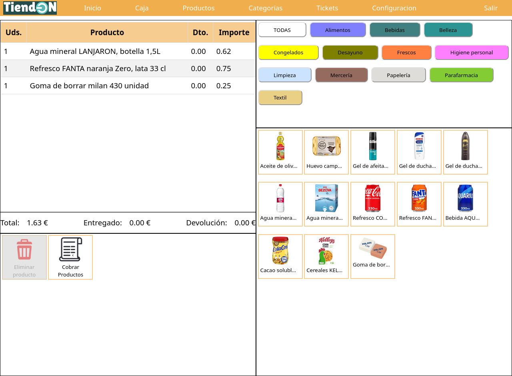
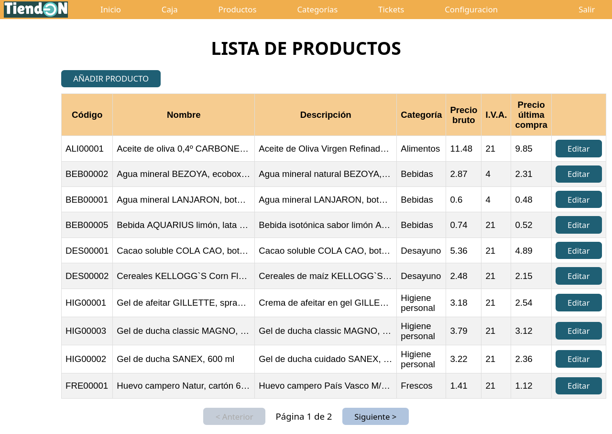
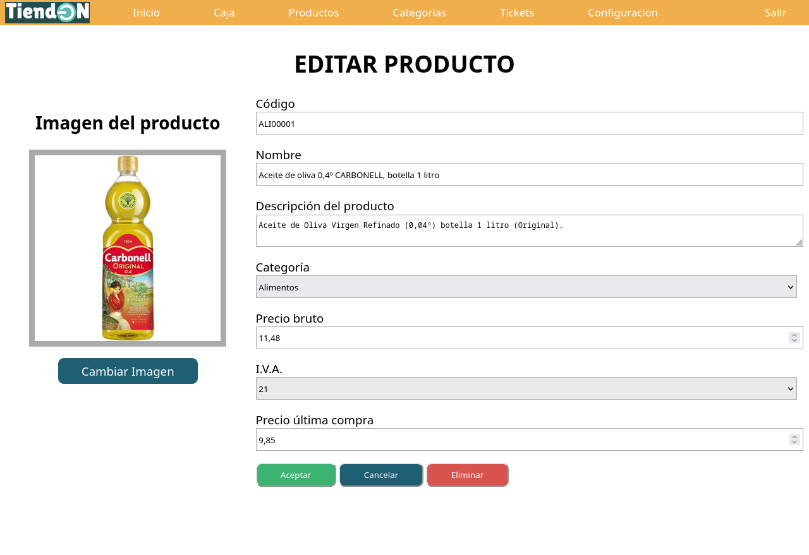

# Proyectos

Estos son proyectos que he realizado en los cursos y fuera de ellos con el interés de ir aumentando mis conocimientos en programación.

## TPV (Terminal Punto de Venta)

Proyecto que me tocó realizar para fin del curso **IFCD0210 - Desarrollo de Aplicaciones Con Tecnologías WEB** (2023-2024). No se especificaba nada más que hacer un TPV, el resto era a libre elección. No he usado ningún framework ni CMS. Se pedía realizar las funciones que se consiguieran dentro del plazo de entrega.

Se ha realizado utilizando:
- Sistema LAMP con Linux, Apache, MySQL y PHP.
- PHP 8
- MySQL 8
- HTML5
- CSS3
- JavaScript

### Esquema de base de datos

Se plantea una base de datos con una estructura que permita seguir ampliando el proyecto. El esquema entidad relación final es el siguiente:

Para montar la base de datos necesaria se puede usar el archivo [tpv.sql](./tpv.sql) de este mismo directorio.

El usuario y contraseña para acceder a la base creada se indica en el archivo ubicado dentro del proyecto en [TPV_(Terminal_Punto_de_Venta)/Model/tpvBD.php](TPV_(Terminal_Punto_de_Venta)/Model/tpvBD.php), asignando al principio del archivo los valores a las variables `$usuarioBD` y `$passBD`.

### Pantallazos de la aplicación WEB

[comment]:# (Estructura de imágenes hecha con tablas porque en GitHub no respetaba la realizada con código HTML)

|  |  |
| --- | --- |
|  |  |
|  |  |

### Instalación de la aplicación WEB

Para probar la aplicación WEB del TPV se necesita tener en local:

- Un servicio LAMP, XAMP o WAMP.
- Un servidor MySQL.
- Situar el contenido del directorio `TPV_(Terminal_Punto_de_Venta)` en el directorio del localhost.
- Crear la base de datos `tpv` y sus tablas correspondientes. Esto se puede hacer con el archivo [tpv.sql](./tpv.sql) el cual también introducirá algunos datos.
- Indicar en el archivo del proyecto `Model/tpvBD.php` el usuario y contraseña que tendrá acceso a la BD `tpv` generada en el paso anterior.
- Accediendo al `localhost` se debería cargar la pantalla de inicio.
